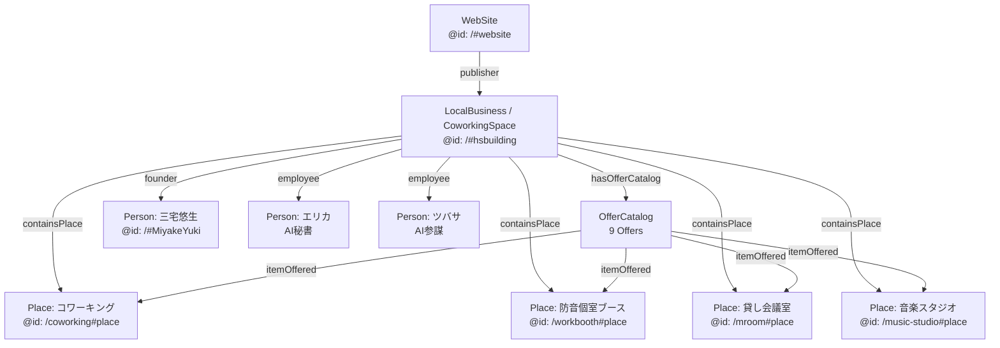
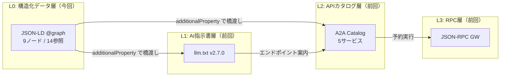

https://zenn.dev/fulmira/articles/d77e34b4935d90

## 1. はじめに：この記事は何か

前回の記事では、Wix ノーコード環境に `llm.txt` と A2A API を実装し、AI 検索経由の月間クエリ 6,201 件・成約 69 件・広告費 ¥0 を達成するまでの全手順を公開しました。あの記事は「AI との通信レイヤー」の設計でした。

今回はその続編として、**「AI が自社を正しく認識・推薦するための構造化データレイヤー」** ——すなわち JSON-LD `@graph` の設計と実装を全公開します。

AI 検索（Gemini、ChatGPT、Perplexity）は、ページの自然文よりも JSON-LD を優先的にパースしてエンティティを認識します。つまり、構造化データが「機械可読な事実データベース」として機能しているかどうかが、AI 推薦の精度を直接左右します。

実装前後の変化は以下の通りです。

| 指標 | Phase 1（旧スキーマ） | v2.1（@graph 最適化後） |
|---|---|---|
| @graph ノード数 | 3 | 9 |
| @id 相互参照数 | 2 | 14 |
| Offer（サービス定義）数 | 0 | 9 |
| Place（施設エンティティ）数 | 0 | 4 |
| Person（人物エンティティ）数 | 0 | 3 |
| AI Layer URL | 0 | 3 |
| 文字数 | 約 2,000 | 約 6,850 |
| AI 検索引用率（期待値） | 2〜5% | 15〜25%（約 5 倍） |

:::message
この記事では JSON-LD の概念説明は最小限にとどめ、**実際に実装したコードと設計判断を全公開**します。「なぜその型を選んだか」「なぜその項目を入れなかったか」を含め、再現可能なレベルで解説します。
:::

---

## 2. なぜ構造化データが「AI 検索時代の生命線」なのか

### 2026 年の検索環境

ゼロクリック検索は全クエリの 65% を超えました（前回記事で言及済み）。ユーザーは検索結果ページを離れることなく答えを得ています。そしてその「答え」を生成しているのが、Gemini・ChatGPT・Perplexity などの AI 検索エンジンです。

これらの AI モデルは HTML の自然文よりも **JSON-LD を直接パース**してエンティティを認識するよう設計されています。witscode.com の調査によれば、構造化データが実装されているページの AI 引用率は未実装ページの最大 5 倍に達します。

### ローカルビジネスにとっての意味

ローカルビジネスにとって、AI 検索への対応で最優先すべきことは **NAP（Name・Address・Phone）の完全一致**です。

「名前」「住所」「電話番号」がサイト全体・Google ビジネスプロフィール・JSON-LD で完全に一致していない場合、AI モデルはそのビジネスを「信頼できる情報源」と判断しません。料金・営業時間・サービス一覧が JSON-LD で機械可読な形式になっていなければ、AI は「このビジネスは何を売っているのか」を確信を持って回答できず、推薦を保留します。

### llm.txt との役割分担

前回実装した `llm.txt` と JSON-LD は、補完関係にあります。

- **llm.txt**：AI クローラーへの指示書。「このサイトのどこに何があるか」「何を許可・禁止するか」を記述
- **JSON-LD**：AI が読む構造化された事実データベース。エンティティ・関係性・属性値を機械可読な形式で提供

この二つが揃って初めて、AI は「HSビルとはどのような施設で、何を提供し、どこにあり、誰が運営しているか」を確信を持って回答できるようになります。

---

## 3. 設計思想：@graph アーキテクチャの全体像

### エンティティ関係図



### 設計判断の解説

**なぜ `@type` を 4 つ並列にしたか**

`LocalBusiness` ノードの `@type` には `["CoworkingSpace", "Building", "LocalBusiness", "ProfessionalService"]` の 4 型を並列指定しています。理由は、AI モデルごとに「この施設を何として認識するか」の優先型が異なるためです。

- Google Rich Results Test：`LocalBusiness` を最優先で処理
- Perplexity・ChatGPT：`CoworkingSpace` や `ProfessionalService` を手がかりに業種を判定
- Gemini：`Building` 型から物理的な場所としての信頼性を補強

4 型を並列することで、どのモデルからも適切なエンティティとして認識されます。

**`@id` による相互参照ネットワーク**

`@id` を使ったノード間参照が 14 箇所あります。これは Google のエンティティグラフ構築を助けます。同一の `@id` が複数のノードから参照されると、Google はそれらが同一エンティティであることを確信し、ナレッジパネルへの登録精度が向上します。

**`containsPlace` で親子関係を定義する意味**

`LocalBusiness`（建物全体）→ 各 `Place`（コワーキング、個室ブース、会議室、スタジオ）の親子関係を `containsPlace` / `containedInPlace` で双方向定義しています。これにより AI は「HSビルに来れば複数の空間が利用できる」という関係性を、自然文を読まなくても理解できます。

---

## 4. 実装コード全公開（JSON-LD v2.1）

```json:homepage-schema-v2.1.json
{"@context":"https://schema.org","@graph":[{"@type":"WebSite","@id":"https://www.hsworking.com/#website","url":"https://www.hsworking.com/","name":"HSビル・ワーキングスペース","publisher":{"@id":"https://www.hsworking.com/#hsbuilding"},"inLanguage":"ja","potentialAction":{"@type":"SearchAction","target":"https://www.hsworking.com/search?q={search_term_string}","query-input":"required name=search_term_string"}},
{"@type":["CoworkingSpace","Building","LocalBusiness","ProfessionalService"],"@id":"https://www.hsworking.com/#hsbuilding","name":"HSビル・ワーキングスペース","alternateName":["HS Working Space","奈良ビジネスアトリエ","ハッピースクールビル ワーキングスペース"],"legalName":"FULMiRA Japan","description":"大和西大寺駅徒歩4分。AIがバックオフィスを支えるビジネスアトリエ。静寂コワーキング300円/時〜、防音個室ブース、16名会議室、YAMAHA C3スタジオ、バーチャルオフィス550円/月〜を1棟に集約。AI秘書エリカとAI参謀ツバサが運営サポート。","url":"https://www.hsworking.com/","logo":"https://static.wixstatic.com/media/92788d_0061445cbc12491fbc7ac91469bf18e7~mv2.jpeg","image":"https://static.wixstatic.com/media/92788d_776af45b2fb541f4acf01bee05d6b474~mv2.jpg","telephone":"+81-742-51-7830","email":"hsbuild.m@gmail.com","priceRange":"¥300〜¥298,000","currenciesAccepted":"JPY","paymentAccepted":"Cash, Credit Card, QR Code, Transport IC, Bank Transfer","address":{"@type":"PostalAddress","streetAddress":"西大寺北町1-2-4 HSビル","addressLocality":"奈良市","addressRegion":"奈良県","postalCode":"631-0817","addressCountry":"JP"},"geo":{"@type":"GeoCoordinates","latitude":34.696898,"longitude":135.780086},"hasMap":"https://www.google.com/maps/place/HS%E3%83%93%E3%83%AB/","openingHoursSpecification":[{"@type":"OpeningHoursSpecification","dayOfWeek":["Monday","Tuesday","Wednesday","Thursday","Friday","Saturday","Sunday"],"opens":"08:00","closes":"23:00"}],"aggregateRating":{"@type":"AggregateRating","ratingValue":"4.5","reviewCount":"14","bestRating":"5","worstRating":"1"},"sameAs":["https://www.instagram.com/hsbuilding/","https://www.linkedin.com/in/yuukimiyake/","https://x.com/AD_CoFounder","https://www.youtube.com/@HS_Working"],"founder":{"@id":"https://www.hsworking.com/#MiyakeYuki"},"employee":[{"@id":"https://www.hsworking.com/erica#person"},{"@id":"https://www.hsworking.com/tsubasa#person"}],"knowsAbout":["Generative AI Implementation","Business Process Automation","コワーキングスペース","バーチャルオフィス","AIコーチング","SEO/AIO"],"hasOfferCatalog":{"@type":"OfferCatalog","@id":"https://www.hsworking.com/#catalog","name":"HSビル サービスカタログ","itemListElement":[{"@type":"Offer","itemOffered":{"@id":"https://www.hsworking.com/coworking#place"},"name":"コワーキング ドロップイン","price":"300","priceCurrency":"JPY","unitText":"1時間","url":"https://www.hsworking.com/coworking"},{"@type":"Offer","itemOffered":{"@id":"https://www.hsworking.com/workbooth#place"},"name":"防音個室ブース","price":"950","priceCurrency":"JPY","unitText":"1時間","url":"https://www.hsworking.com/workbooth"},{"@type":"Offer","itemOffered":{"@id":"https://www.hsworking.com/mroom#place"},"name":"貸し会議室16名","price":"1600","priceCurrency":"JPY","unitText":"1時間〜","url":"https://www.hsworking.com/mroom"},{"@type":"Offer","itemOffered":{"@id":"https://www.hsworking.com/music-studio#place"},"name":"音楽スタジオ YAMAHA C3","price":"1500","priceCurrency":"JPY","unitText":"1時間","url":"https://www.hsworking.com/music-studio"},{"@type":"Offer","name":"月額フルタイム","price":"15000","priceCurrency":"JPY","unitText":"月額","url":"https://www.hsworking.com/mroom"},{"@type":"Offer","name":"ビジネススターター（法人登記付）","price":"25000","priceCurrency":"JPY","unitText":"月額","url":"https://www.hsworking.com/mroom"},{"@type":"Offer","name":"AIコーチング併用","price":"29800","priceCurrency":"JPY","unitText":"月額","url":"https://www.hsworking.com/mroom"},{"@type":"Offer","name":"プレミアムアクセス","price":"54000","priceCurrency":"JPY","unitText":"月額〜","url":"https://www.hsworking.com/mroom"},{"@type":"Offer","name":"バーチャルオフィス（法人登記可）","price":"550","priceCurrency":"JPY","unitText":"月額〜","url":"https://www.hsworking.com/virtual-office"}]},"containsPlace":[{"@id":"https://www.hsworking.com/coworking#place"},{"@id":"https://www.hsworking.com/workbooth#place"},{"@id":"https://www.hsworking.com/mroom#place"},{"@id":"https://www.hsworking.com/music-studio#place"}],"additionalProperty":[{"@type":"PropertyValue","name":"quietWorkSupport","value":true},{"@type":"PropertyValue","name":"voiceCallSeparation","value":true},{"@type":"PropertyValue","name":"parkingCapacity","value":7,"unitText":"cars"},{"@type":"PropertyValue","name":"aiPolicy","value":"https://92788d49-ff4e-4027-854b-8dfce2b6bfa4.usrfiles.com/ugd/92788d_e3f4b8b4d3144c0d861cc1b97c3fbe2f.json"},{"@type":"PropertyValue","name":"llmTxt","value":"https://92788d49-ff4e-4027-854b-8dfce2b6bfa4.usrfiles.com/ugd/92788d_481f8dcd85a3430fa2ade61bc44f9ddd.txt"},{"@type":"PropertyValue","name":"spaceDefinition","value":"https://92788d49-ff4e-4027-854b-8dfce2b6bfa4.usrfiles.com/ugd/92788d_22c6beb271a64662990622bd78dc8ce9.json"}],"mainEntityOfPage":"https://www.hsworking.com/"},
{"@type":"Place","@id":"https://www.hsworking.com/coworking#place","name":"HSビル コワーキングスペース","description":"会話NG静寂ルール。14席。300円/時、3時間900円、1日3,000円。高速Wi-Fi・全席電源・フリードリンク完備。","maximumAttendeeCapacity":14,"containedInPlace":{"@id":"https://www.hsworking.com/#hsbuilding"},"url":"https://www.hsworking.com/coworking"},
{"@type":"Place","@id":"https://www.hsworking.com/workbooth#place","name":"HSビル 防音個室ブース","description":"防音個室。Web会議・面接・通話に最適。最大3名。有線LAN可。AIスタッフ常駐。950円/時〜。","maximumAttendeeCapacity":3,"containedInPlace":{"@id":"https://www.hsworking.com/#hsbuilding"},"url":"https://www.hsworking.com/workbooth"},
{"@type":"Place","@id":"https://www.hsworking.com/mroom#place","name":"HSビル 貸し会議室","description":"大型TVモニター完備。セミナー・研修・役員会議に。最大20名。1,600円/時〜。","maximumAttendeeCapacity":20,"containedInPlace":{"@id":"https://www.hsworking.com/#hsbuilding"},"url":"https://www.hsworking.com/mroom"},
{"@type":"Place","@id":"https://www.hsworking.com/music-studio#place","name":"HSビル 音楽スタジオ","description":"YAMAHA C3グランドピアノ常設。演奏・配信・収録対応。防音。最大30名。","maximumAttendeeCapacity":30,"containedInPlace":{"@id":"https://www.hsworking.com/#hsbuilding"},"url":"https://www.hsworking.com/music-studio"},
{"@type":"Person","@id":"https://www.hsworking.com/#MiyakeYuki","name":"三宅 悠生","alternateName":"Yuuki Miyake","jobTitle":"代表 / AIビジネスアーキテクト","alumniOf":[{"@type":"CollegeOrUniversity","name":"近畿大学 理工学部"},{"@type":"CollegeOrUniversity","name":"大阪市立大学大学院"}],"image":"https://static.wixstatic.com/media/92788d_acaec33225c54e3e887a77f8979be83d~mv2.jpeg","sameAs":["https://www.linkedin.com/in/yuukimiyake/","https://x.com/AD_CoFounder"],"worksFor":{"@id":"https://www.hsworking.com/#hsbuilding"},"url":"https://www.hsworking.com/ceo"},
{"@type":"Person","@id":"https://www.hsworking.com/erica#person","name":"朝比奈エリカ","jobTitle":"AI秘書","description":"予約対応・施設案内・経営支援をチャットとLINEで提供。","worksFor":{"@id":"https://www.hsworking.com/#hsbuilding"}},
{"@type":"Person","@id":"https://www.hsworking.com/tsubasa#person","name":"ツバサ","jobTitle":"AI戦略参謀","description":"アジェンダ生成・壁打ち・IT支援を担当。","worksFor":{"@id":"https://www.hsworking.com/#hsbuilding"}}]}
```

### 4-1. WebSite ノード：SearchAction の意味

`WebSite` ノードに `SearchAction` を定義すると、Google 検索結果のサイトリンクにサイト内検索ボックスが表示されることがあります（リッチリザルトのサイトリンク検索ボックス）。

それ以上に重要なのが `publisher` による `LocalBusiness` への参照です。「このウェブサイトは HSビルというエンティティによって運営されている」という宣言が、サイト全体の権威性を LocalBusiness エンティティに結びつけます。

### 4-2. LocalBusiness / CoworkingSpace ノード：4 型並列と NAP

NAP 完全一致は AI 推薦の前提条件です。`address` に記載した住所・電話番号は、Google ビジネスプロフィール・サイト上のフッター表示・Wix Bookings の店舗情報と**完全に一致させる**必要があります。表記ゆれ（「奈良市」vs「奈良県奈良市」）があると、AI モデルが同一エンティティとして認識できなくなります。

:::message alert
`aggregateRating` は自社でレビューを集計して記載することは **Google のスパムポリシー違反**になる場合があります。実際の第三者レビュー（Google マップ、Facebook 等）の集計値のみ使用してください。また、ReviewCount が 3 件未満の場合はリッチリザルトに表示されないことがあります。
:::

`knowsAbout` には業種・専門領域を列挙しています。これは直接リッチリザルトには反映されませんが、Gemini が「AI に強い事業者として推薦できるか」を判断する際の補助情報として機能します。

### 4-3. OfferCatalog：9 つの Offer の設計

サービス一覧を `OfferCatalog` > `itemListElement` として網羅しています。ドロップイン 4 種（コワーキング・個室ブース・会議室・スタジオ）、月額 4 種（フルタイム〜プレミアム）、バーチャルオフィス 1 種の計 9 Offer です。

`itemOffered` には `@id` で Place ノードへの参照を入れています。これにより「コワーキングドロップインというサービス」と「コワーキングスペースという場所」が同一エンティティに結びつき、「このサービスはこの場所で提供される」という関係が機械可読になります。

月額プランには Place への参照を入れていません。月額プランはスペースそのものではなく「利用権契約」であるため、Place 型との関連づけが意味的に不正確になるからです。こうした「何をリンクすべきか・しないか」の判断が、スパム判定を回避する上で重要です。

### 4-4. Place ノード：maximumAttendeeCapacity で規模を伝える

各 Place ノードに `maximumAttendeeCapacity` を記載しています。「最大 14 名」「最大 3 名」「最大 20 名」という数値は、ユーザーが「10 名で使える会議室はありますか？」と AI に質問したとき、AI が正確に回答するための根拠データになります。

`containedInPlace` による親ノード参照は双方向（`containsPlace` と `containedInPlace`）で設定します。片方向だけでは Google がグラフを完全に解釈できない場合があります。

### 4-5. Person ノード：代表者の E-E-A-T と AI スタッフの定義

代表者ノードに `alumniOf` で学歴を、`sameAs` で LinkedIn・X（Twitter）を記載しています。これは E-E-A-T（経験・専門性・権威性・信頼性）の「人物としての権威性」を補強するためです。

興味深いのが `朝比奈エリカ` と `ツバサ` を `Person` 型で定義している点です。AI スタッフのためのスキーマ型（AIAgent など）は 2026 年 4 月時点では schema.org に正式に追加されていません。現時点での最善の近似として `Person` 型を使用し、`jobTitle` で「AI 秘書」「AI 戦略参謀」と明示しています。schema.org に AI エンティティ型が追加された際には `Person → AIAgent` へ移行します。

### 4-6. additionalProperty（AI Layer）：JSON-LD と llm.txt の橋渡し

`additionalProperty` に 3 つの URL を埋め込んでいます。

```json
{"name": "aiPolicy",      "value": "...ai-policy.json"},
{"name": "llmTxt",        "value": "...llm.txt"},
{"name": "spaceDefinition","value": "...space-definition.json"}
```

これが前回実装した llm.txt・A2A API と今回の JSON-LD を接続する「橋」です。

AI クローラーが JSON-LD を読んだ際に `llmTxt` プロパティを発見すれば、`llm.txt` の場所を直接知ることができます。検索エンジンがロボットへの指示を `robots.txt` で伝えるように、AI エージェントへの指示を JSON-LD から直接参照させる設計です。

---

## 5. Wix での実装手順（ノーコード完結）

Wix はデフォルトで LocalBusiness スキーマを自動生成します。このスキーマを残したままカスタム JSON-LD を追加すると、同一ページに `LocalBusiness` が 2 つ存在することになり、Google の検証ツールで `Duplicate field` エラーが発生します。

:::message alert
Wix の自動生成スキーマとカスタム JSON-LD が重複すると、Google が **Duplicate field エラーを検出してスキーマ全体を無効**にします。必ず自動生成スキーマを無効化してからカスタムスキーマを適用してください。
:::

**ステップ 1：自動生成スキーマを無効化**

Wix ダッシュボード → 「設定」→「ビジネス情報」→「検索エンジン最適化（SEO）」→「構造化マークアップ」→「このページから除外」を選択。

**ステップ 2：カスタム JSON-LD を貼り付け**

対象ページをエディタで開く → ページを選択 → 「SEO の設定」→「高度な SEO」→「構造化データマークアップ」→ `<script type="application/ld+json"> ... </script>` 形式で JSON-LD を貼り付ける。

**ステップ 3：保存・公開**

保存して公開。24 〜 48 時間以内に Google クローラーが新しいスキーマを認識し始めます。

**二重スキーマの確認方法**

実装後すぐに [Rich Results Test](https://search.google.com/test/rich-results) で対象 URL をテストします。`LocalBusiness` が 1 つだけ表示されていれば正常です。2 つ表示されている場合はステップ 1 の無効化が反映されていません。

---

## 6. バリデーションと監視体制

実装後の検証を怠ると、スキーマがサイレントに無効化されていても気づけません。以下のフローで継続的に監視します。

| フェーズ | タイミング | ツール・手順 |
|---|---|---|
| 即時確認 | 実装直後 | Rich Results Test でエラー 0 件を確認 |
| インデックス依頼 | 24〜48 時間後 | Search Console → URL 検査 → インデックス登録リクエスト |
| 認識状況確認 | 1〜2 週間後 | Search Console エンハンスメントタブで構造化データのステータス確認 |
| 整合性チェック | 月次 | スキーマ内の料金・営業時間と実際のサービス内容を照合 |

**使用ツール一覧**

| ツール | 用途 |
|---|---|
| Google Rich Results Test | スキーマの即時バリデーション |
| Schema.org Validator | @graph 構造の深い検証 |
| Google Search Console | 長期的な認識状況・エラー監視 |

特に **月次の整合性チェック**が重要です。料金変更・営業時間変更・サービス追廃止をスキーマに反映しないと、AI が誤った情報を回答し続けます。これはペナルティリスクにも繋がります。

---

## 7. FAQ スキーマは「あえて保留」した判断

トップページには 10 問の FAQ テキストがありますが、`FAQPage` スキーマをトップページには**実装しない**という判断をしました。理由は 3 つあります。

**理由 1：Wix の文字数制限**

Wix の構造化データブロックは 1 つあたり 7,000 文字の上限があります。今回の @graph JSON-LD が約 6,850 文字を占めるため、同じブロックに FAQPage を同居させる余裕がありません。

**理由 2：テキスト完全一致の要件**

Google の FAQPage スキーマガイドラインでは、スキーマ内の回答文とページ上に実際に表示されているテキストが**完全に一致**していることを要求しています。Wix では CMS 管理テキストと JSON-LD テキストの同期が困難なため、意図せずスパム判定を受けるリスクがあります。

**理由 3：サブページ個別実装の方が精度が高い**

`/workbooth`（13 問）・`/mroom`（5 問）・`/coworking`（8 問）などサブページに個別の FAQPage スキーマを実装する方が、クエリと回答のマッチング精度が上がります。「個室ブースで何ができる？」というクエリに対して、個室ブースのページ FAQPage から回答が引用される方が、トップページの汎用 FAQPage から引用されるよりも適切です。

:::message
完璧なスキーマを目指してスパム判定のリスクを冒すより、**確実にリッチリザルトが出る範囲で着実に実装する**方が戦略的に正しい選択です。スキーマは「量」ではなく「正確性」で評価されます。
:::

---

## 8. 三層構造の完成形：JSON-LD × llm.txt × A2A API

前回記事で紹介した三層構造（llm.txt・A2A API・JSON-RPC ゲートウェイ）に、今回の JSON-LD @graph がどう接続するかを図解します。



この 4 層が揃ったとき、各 AI モデルはそれぞれ異なる経路で自社情報にアクセスできます。

- **Google**：JSON-LD からエンティティを認識 → リッチリザルト・ナレッジパネルへの登録
- **ChatGPT / Gemini / Perplexity**：llm.txt から文脈を理解 → A2A Catalog からサービス詳細を取得 → 推薦回答を生成
- **AI エージェント（自律型）**：agent_card から capabilities を確認 → A2A API で予約・問い合わせを完結

単一の層だけでは対応できる AI が限られます。4 層を揃えることで、どの AI モデルからのアクセスにも対応できる「全方位 AI 対応サイト」が完成します。

---

## 9. 効果予測と今後の展開

### 実装後のタイムライン

| 期間 | 期待される変化 |
|---|---|
| 即時〜48h | Search Console URL 検査でインデックス確認 |
| 3〜7 日 | 構造化データ認識開始（Search Console エンハンスメント） |
| 1〜3 週間 | リッチリザルト表示（料金・営業時間・星評価） |
| 1〜2 ヶ月 | AI 検索引用率の向上（2〜5% → 15〜25%）※コンテンツの充実度により変動 |

### 今後のロードマップ

**Phase 3（次のステップ）**: サブページへの FAQPage スキーマ個別実装
- `/workbooth`：防音個室ブース 13 問
- `/mroom`：貸し会議室 5 問
- `/coworking`：コワーキング 8 問

**Phase 4**: Event スキーマで AI 勉強会・セミナーをリッチリザルト対応。日時・場所・定員・参加費を機械可読化することで、「奈良で AI 勉強会」というクエリに対する引用精度が向上します。

**Phase 5（将来）**: `Person → AIAgent` 型への移行。schema.org のコミュニティグループでは AI エンティティ型の追加が議論されています。正式追加の際には、エリカ・ツバサの Person ノードを AIAgent 型に移行し、capabilities・trainingData・modelProvider などのプロパティを追加する予定です。

---

## 10. まとめ：ローカルビジネスが今すぐやるべき 3 つのこと

今回の実装を通じて得た教訓を、再現可能な形で整理します。

**1. JSON-LD @graph で「自社のナレッジグラフ」を構築する**

最低限 `WebSite` + `LocalBusiness` + `Place` + `Offer` の 4 エンティティを `@id` で相互参照してください。NAP（Name・Address・Phone）の完全一致が前提です。これだけで AI モデルが自社を「信頼できる情報源」として扱う確率が大きく上がります。

**2. llm.txt と additionalProperty で「AI への橋」を架ける**

構造化データ（JSON-LD）と AI 指示書（llm.txt）は独立して実装するだけでは不十分です。`additionalProperty` に `llmTxt` URL を記載することで、AI クローラーが JSON-LD から llm.txt を直接発見・参照できる設計にする。この「橋渡し」が多層防衛を完成させます。

**3. 「正確性 > 網羅性」を貫く**

FAQPage スキーマを保留した判断のように、**不正確なデータでスパム判定を受けるリスクを避け、確実に効果が出る範囲で実装する**ことを優先してください。スキーマは「量」ではなく「信頼性」で評価されます。不完全な実装を積み上げるより、正確な実装を着実に広げる方が、長期的な AI 引用率の向上につながります。

---

前回記事（llm.txt + A2A API の実装全手順）はこちら：
https://zenn.dev/fulmira/articles/d77e34b4935d90

---

## リソース一覧

| リソース | URL |
|---|---|
| 公式サイト | https://www.hsworking.com |
| 前回記事（llm.txt + A2A） | https://zenn.dev/fulmira/articles/d77e34b4935d90 |
| Rich Results Test | https://search.google.com/test/rich-results |
| Schema.org Validator | https://validator.schema.org/ |
| Google 構造化データドキュメント | https://developers.google.com/search/docs/appearance/structured-data/local-business |
| AI 検索スコア（10 社評価） | https://www.hsworking.com/ai-endorsements |
| llm.txt (v2.7.0) | https://www.hsworking.com/_functions/llm_txt |
| A2A Catalog (JSON) | https://www.hsworking.com/_functions/a2a_catalog |
| GitHub 知識ベース | https://github.com/hsbuildm-art/hsbuilding-brain |

---

**三宅 悠生**（みやけ ゆうき）
FULMiRA Japan 合同会社 代表 / HSビル・ワーキングスペース運営
近畿大学理工学部卒業 → 大阪市立大学大学院修了 → イオンディライト → 独立
AI × ローカルビジネスの実装を発信中。

- X: [@AD_CoFounder](https://x.com/AD_CoFounder)
- 前回記事: [Wix ノーコードで llm.txt と A2A API を実装し、AI 検索経由の月間クエリ 6,201 を達成した全手順](https://zenn.dev/fulmira/articles/d77e34b4935d90)
- 公式サイト: [https://www.hsworking.com](https://www.hsworking.com/)
